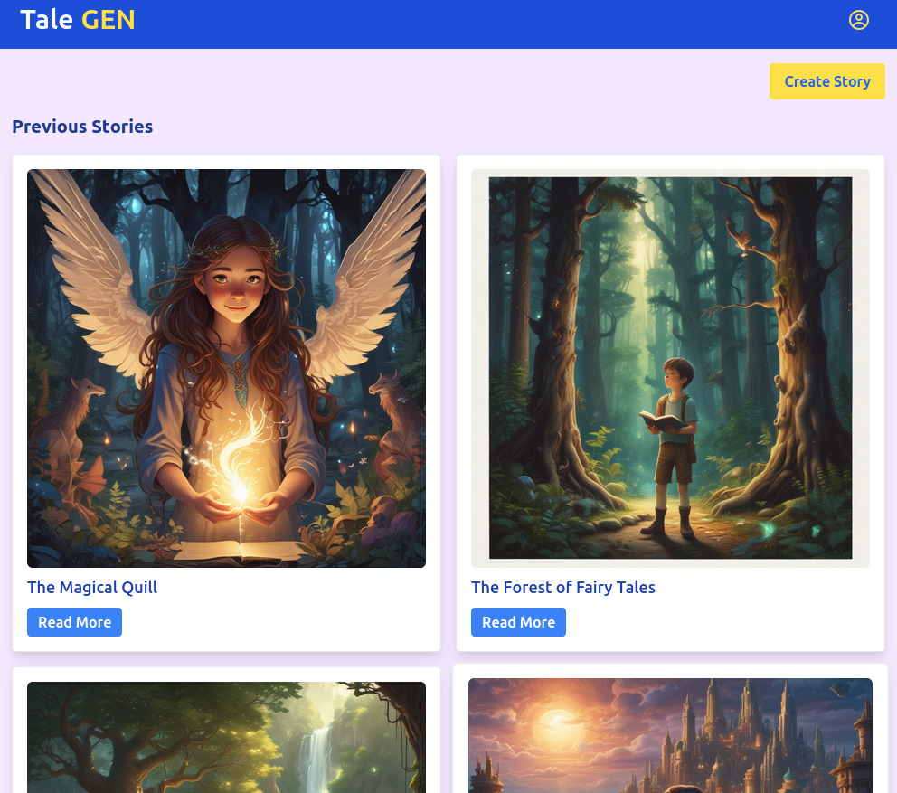
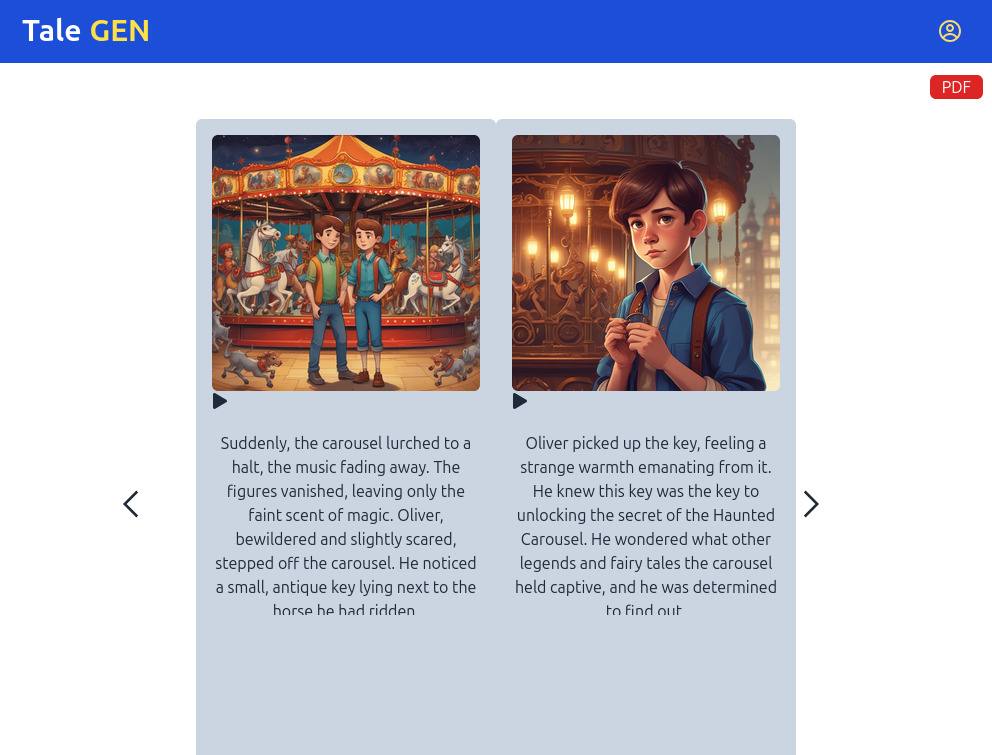
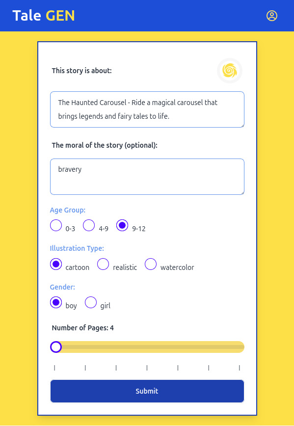

# TaleGen 🎯

## Basic Details
### Team Name: M_society

### Team Members
- Team Lead: Aravind Gopan - Saintgits Collage of Engineering
- Member 2: Anwin Jayan - Saintgits Collage of Engineering
- Member 3: Akshay M - Saintgits Collage of Engineering

### Project Description
Parents often struggle to find the time and energy to create new bedtime stories for their children every night. Children love hearing bedtime stories, especially ones that involve them as the main character. Our goal is to provide a solution that helps parents create engaging and personalized bedtime stories effortlessly.

### The Problem (that doesn't exist)
Current story creation tools often lack interactivity and personalization, leading to a static reading experience. Many existing platforms do not integrate images and audio, missing the opportunity to engage young readers fully. This gap results in children not experiencing the benefits of dynamic storytelling that fosters creativity and learning.

### The Solution (that nobody asked for)
Talegen offers a unique platform that automatically generates storybooks based on user prompts, integrating vivid images and audible narration. By leveraging AI technology, Talegen personalizes each story to match the child's interests and developmental stage, creating an engaging, interactive experience. This solution not only enhances traditional storytelling but also makes it accessible to children, encouraging imagination and fostering a love for reading.

## Technical Details
### Technologies/Components Used
For Software:
- Javascript
- React js, Express js
- @paypal/react-paypal-js, @reduxjs/toolkit, @stripe/stripe-js, axios, html2canvas, jspdf, lucide-react, react, react-dom, react-icons, react-pageflip, react-redux, react-router-dom, redux-persist
- vite, eslint, @vitejs/plugin-react, daisyui, tailwindcss, Gemini api, Byte Dance image model

### Implementation
For Software: Our workflow involves implementing an AI story generator based on user-provided prompts using the MERN stack. The user inputs a prompt into the Gemini API, which generates a story according to specified parameters such as page number and style. Gemini also produces additional prompts that serve as inputs for the ByteDance image generation model to create illustration links for each page and the cover page. These image links are then passed to Cloudinary for storage. All of this data is organized into collections in MongoDB: stories, pages, and users.
# Installation
npm install

# Run
client:
 - cd client
 - npm run dev
server:
 - cd api
 - node app.js

### Project Documentation
For Software:

  - CREATE STORY POST -/api/v1/stories/
  - ALL STORY GET -/api/v1/stories/
  - STORY PAGES GET -/api/v1/:id/pages
  -  STORY DETAILS GET -/api/v1/:id
  -  DELETE STORY DEL -/api/v1/:id
  -  CREATE USER POST-/api/v1/user/register
  -  LOGIN USER POST-/api/v1/user/login

# Screenshots (Add at least 3)

*Add caption explaining what this shows*

*Add caption explaining what this shows*

*Add caption explaining what this shows*

# Diagrams

*Add caption explaining your workflow*

### Project Demo
# Video
https://drive.google.com/file/d/11L5xziormpYm2L1k6SaZJ3f_2_DpbKu3/view?usp=sharing

## Team Contributions
- Aravind Gopan: Frontend Developement
- Anwin Jayan: Backend Development
- Akshay M: Full stack Developer

---
Made with ❤️ at TinkerHub Useless Projects 

